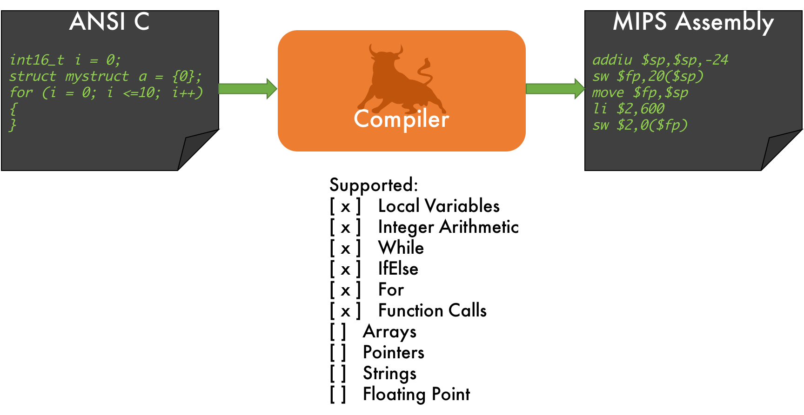

ANSI C to MIPS Compiler
=========================



The program accepts C90 source code on stdin and writes its outputs on stdout/stderr. 

Input Format
------------

The input format is C90.

Output Format
-------------

The output format is MIPS1 assembly code.

It should be possible to assemble and link this code
against a C run-time, and have it execute correctly
on a MIPS processor as emulated by `qemu-mips`.

Compilation
-----------

The compiler is built using:
````
make bin/c_compiler
````
and the resulting program is called `bin/c_compiler`.

The target environment is Ubuntu 16.04.

Usage of the compiler
-----
A number of C90 programs can be converted at once. 

Place the code in test/Compiler/in and run the compiler_script.sh to find the assembly outputs in test/Compiler/out.


Approach
----------------

The API involves a context class and memory class. Each class can thereafter generate their own code, without considering other classes.

Context is used to keep track of the scoping, as well as mapping of the variable. The context knows the current scope, and therefore all the declarations within the scope and above it; essentially forming a separate symbol table for each scope. The index of the vector corresponds to the current scope, and the vectors in the structs store the bindings. Subroutines can be called from the context class, as it keeps track of the current function. Allocation of appropriate amounts of memory is evaluated using a separate member function.

Registers and stack allocation are handled by a separate class, passed in the same way as the context. A vector of pointers to structs (that have their own vector) is used for this purpose, with the current value being a string (as they do not have to be initialised). This allows the obtaining of free space (as stack or registers), writing to it, and freeing it as and when necessary. Whether or not a register or the stack is required depends on the member function using it.
